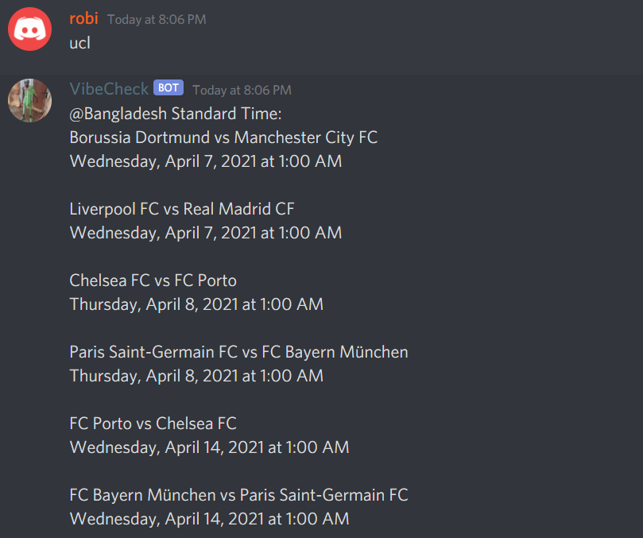

## VibeCheck Discrod Bot ## 

# Implemented Commands: #
* 'Vibecheck me' - Vibechecks back the sender
* 'vibecheck @everyone' - Open a 15min window to vibe back using 'vibin' - command
* 'ucl' - Prints the upcoming UCL mathces
* 'pl table' - Prints the top 10 Premier League teams in the current league table

TODO:
* Hide your token key with .gitignore?? Token needed in heroku

# Screenshots # 
* Vibecheck me - command

* vibecheck @everyone

  

* ucl - command

* pl table - command

